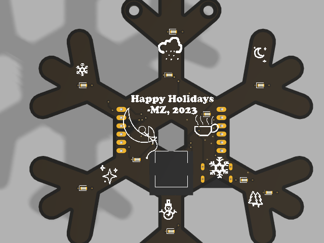

# holiday_project_2023

I designed a custom circuit and printed circuit board using a 555 timer and a 4017 decade counter to be my christmas cards for 2023.  
  
 

You can see a video of me soldering one up [here](https://youtu.be/d3nHeJJm5tU). You can see a video demo [here](https://youtube.com/shorts/1BrFW9uY18g?feature=share).

You can find the Gerber files in this repo (the zipped file). You can find the BOM in this repo as well (bom.ods). You can also find a schematic in this repo, the .pdf file.  

All smd components are 0603 size, and were soldered by hand with a soldering iron. It was tricky and not all joints are well soldered--if you have hot air gun solder paste may be a better route.  
